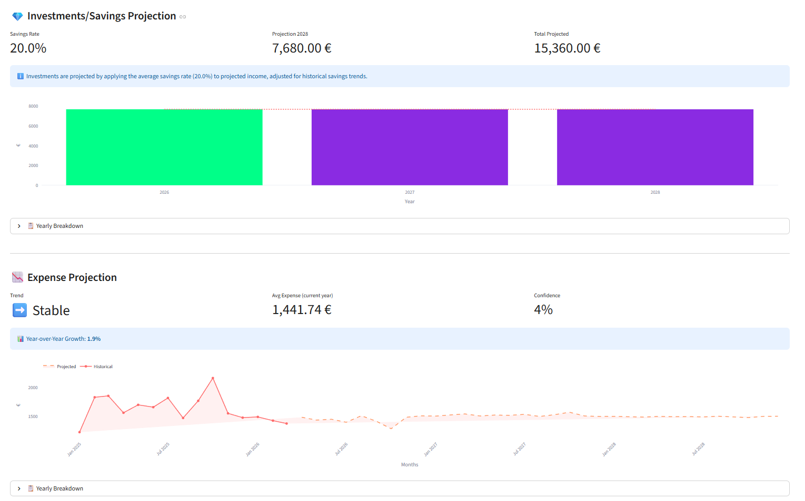
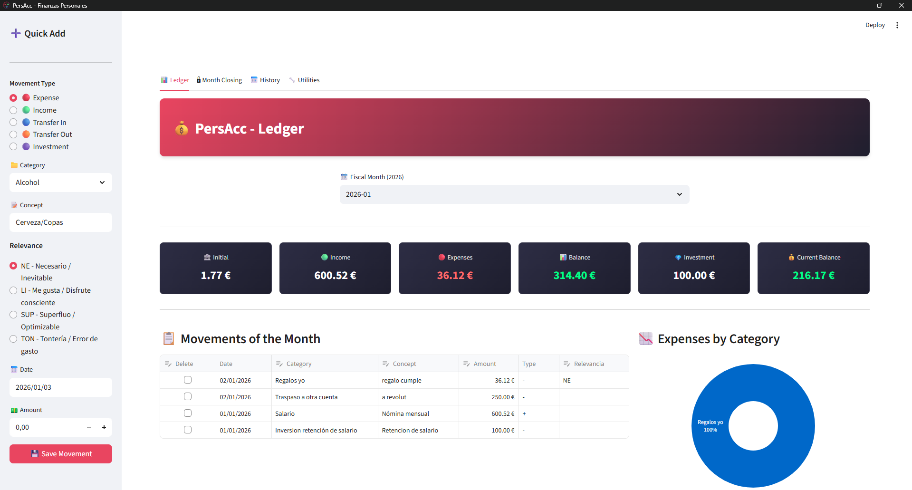
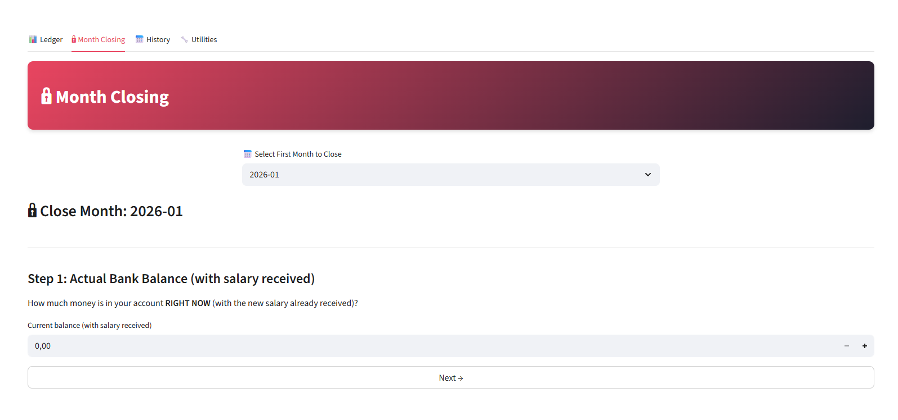

# 💰 PersAcc - Personal Accounting System

> Personal accounting system with monthly closing methodology, automatic savings retention, AI-powered financial analysis, and ML-based projections.

[](https://www.python.org/downloads/)
[](https://streamlit.io/)
[](https://www.sqlite.org/)
[](https://ollama.com/)
[](LICENSE)

## 🎯 What is PersAcc?

**PersAcc** is a personal accounting application designed for people who want **full control over their monthly finances** through a rigorous accounting closing system, enhanced with AI-powered insights and machine learning projections.

### ✨ Key Features

#### 📊 Core Accounting
✅ **Automatic Month Closing** - Step-by-step wizard that calculates retentions, generates immutable snapshots, and opens the next month  
✅ **Configurable Retentions** - Set savings/investment % on surplus balance and salary  
✅ **Expense Classification** - Relevance system (Necessary, Like, Superfluous, Nonsense) to analyze behavior  
✅ **Editable Table** - Modify transactions inline with closed month validation  
✅ **CSV Import/Export** - Migrate from other apps or create backups  

#### 🤖 AI-Powered Features (NEW!)
✅ **Intelligent Search Assistant** - Ask questions in natural language and get instant answers  
✅ **LLM-Based Parameter Extraction** - Smart query understanding with Ollama integration  
✅ **ML Financial Projections** - Predict salaries, expenses, and investments using linear regression  
✅ **Automated Insights** - Get AI-generated recommendations based on your spending patterns  

#### 📈 Analytics & Projections
✅ **Historical Dashboard** - Annual KPIs, monthly evolution, and trend analysis  
✅ **Future Projections** - ML-based predictions for the next 5 years  
✅ **Spending Quality Analysis** - Visual breakdown by relevance category  
✅ **Interactive Charts** - Plotly-powered visualizations with historical vs projected data  

## 🚀 Quick Start

See [**SETUP.md**](SETUP.md) for detailed installation instructions including:
- Local installation (Python)
- Docker deployment
- Ollama AI setup

### Minimal Setup (5 minutes)

```bash
# Clone repository
git clone https://github.com/Alvaro-San-Cav/PersAcc.git
cd PersAcc

# Install dependencies
pip install -r requirements.txt

# Run
streamlit run app.py
```

The app will open at `http://localhost:8501`

## 🧠 AI Features Setup

PersAcc uses **Ollama** for local AI processing (completely offline and free).

### Quick Ollama Setup

1. **Install Ollama**: Download from [ollama.com](https://ollama.com/download)
2. **Download a model**:
   ```bash
   ollama pull phi3  # Recommended (2.3GB)
   ```
3. **Enable in app**: Go to Utilities > AI Configuration > Enable AI
4. **Start searching**: Use the "Search Assistant" tab to ask questions in natural language!

See [**OLLAMA_SETUP.md**](OLLAMA_SETUP.md) for detailed AI configuration.

## 📸 Screenshots

### AI Search Assistant
Ask financial questions in natural language and get instant answers with editable search parameters.


### ML Projections
Machine learning-based forecasts for salaries, investments, and expenses over the next 5 years.



### Main Dashboard
Monthly analysis view with real-time KPIs, editable transactions table, and spending quality chart.



### Month Closing Wizard
Guided 4-step process: real balance, new salary, retentions, and confirmation.



## 📖 Key Concepts

### 🔍 AI Search Assistant

The **Search Assistant** lets you query your financial data using natural language:

**Examples:**
- "¿Cuánto gasté en transporte el año pasado?"
- "Muestra los mayores gastos de diciembre"
- "¿Cuál es mi tasa de ahorro?"

The AI extracts parameters, shows you an editable form, and executes the search when you're ready.

**How it works:**
1. Enter your question in natural language (Spanish or English)
2. AI analyzes and extracts search parameters (concept, category, dates)
3. Review and edit parameters in an interactive form
4. Execute search to see results

### 📈 ML Projections

The **Projections** feature uses machine learning to forecast your financial future:

- **Salary Projections**: Linear regression on historical income data
- **Investment Forecasts**: Based on your savings rate and projected income
- **Expense Predictions**: Trend analysis with confidence scoring

Each projection includes:
- **Confidence Level**: R² score showing prediction reliability
- **Trend Analysis**: Whether values are going up, down, or stable
- **Interactive Charts**: Historical data vs future predictions
- **Year-by-year Breakdown**: Detailed monthly and annual figures

### 💰 Month Closing

The **monthly closing flow** is the heart of PersAcc. Follow these steps:

#### When to Close the Month?
Once you receive next month's salary (even if it's on the 28th), you should start closing the current month.

#### Wizard Steps

1. **Go to the "Month Closing" tab** - The system automatically detects the next month to close

2. **Enter your bank balance** - Input the exact value shown in your bank account at that moment
   - *Traditional mode*: Balance **before** receiving salary
   - *Alternative mode*: Balance **after** receiving salary (configurable in settings)

3. **Enter the salary amount** - Input the gross salary you just received

4. **Configure retentions** - Set what percentage to allocate to investment/savings:
   - **% Surplus Retention**: From leftover money before the new salary
   - **% Salary Retention**: From the new salary received

5. **Execute the closing** - The system:
   - Creates automatic investment entries
   - Generates the salary as income in the new month
   - Calculates and displays the final result
   - Automatically switches to the next month

**Result**: Closed and immutable month + next month ready with correct opening balance.

### 🎯 Spending Relevance

Classify each expense as:
- **NE** (Necessary) - Essential for living
- **LI** (Like) - Brings happiness/well-being  
- **SUP** (Superfluous) - Occasionally justifiable
- **TON** (Nonsense) - Impulsive or regretted

**Goal**: Analyze what % of your spending goes to each category and improve habits.

## 🛠️ Tech Stack

- **Frontend**: Streamlit 
- **Backend**: Python 3.9+
- **Database**: SQLite 
- **AI/ML**: Ollama (local LLM), scikit-learn, NumPy
- **Charts**: Plotly
- **Containerization**: Docker (optional)

## 📝 Typical Usage

### Daily Workflow

1. **Quick Add** (sidebar) - Log expenses in 10 seconds
2. **Analysis** - Review transactions table and monthly KPIs
3. **Search Assistant** - Ask questions about your spending
4. **End of month** - Closing wizard (5 minutes)

### Monthly Review

1. **Historical** - Check monthly trends and patterns
2. **Projections** - See where you're headed financially
3. **AI Insights** - Get automated recommendations

### Closing Example

```
Month: January 2026
Real balance: €1,245
New salary: €2,500
Surplus retention: 50% → €622.50
Salary retention: 20% → €500

→ February starts with €622.50 + €2,500 - €500 = €2,622.50 operational
```

## 🐳 Docker Deployment

```bash
# Build image
docker build -t persacc:latest .

# Run container
docker run -p 8501:8501 -v $(pwd)/data:/app/data persacc:latest
```

Data persists in the `./data` volume. See [SETUP.md](SETUP.md) for more details.

## 🌍 Internationalization

PersAcc supports multiple languages:
- 🇪🇸 Spanish (default)
- 🇬🇧 English

Switch languages in the sidebar.

## 🤝 Contributing

1. Fork the project
2. Create a branch: `git checkout -b feature/amazing-feature`
3. Commit changes: `git commit -m 'Add amazing feature'`
4. Push: `git push origin feature/amazing-feature`
5. Open a Pull Request

## 📄 License

This project is licensed under the **Creative Commons Attribution-NonCommercial-ShareAlike 4.0 International (CC BY-NC-SA 4.0)** license.

The LICENSE file contains the full text of the license.  
**Summary**: You are free to share and adapt the material for non-commercial purposes, as long as you give appropriate credit and distribute your contributions under the same license.

## 🙏 Acknowledgments

- [Streamlit](https://streamlit.io/) - Amazing UI framework
- [Ollama](https://ollama.com/) - Local AI inference
- [Plotly](https://plotly.com/) - Interactive visualizations
- [scikit-learn](https://scikit-learn.org/) - Machine learning library

## 📬 Contact

**Author**: Alvaro Sánchez  
**GitHub**: [@Alvaro-San-Cav](https://github.com/Alvaro-San-Cav)

---

⭐ If PersAcc is useful to you, give the repo a star!

**Version**: 2.0  
**Last updated**: January 2026
