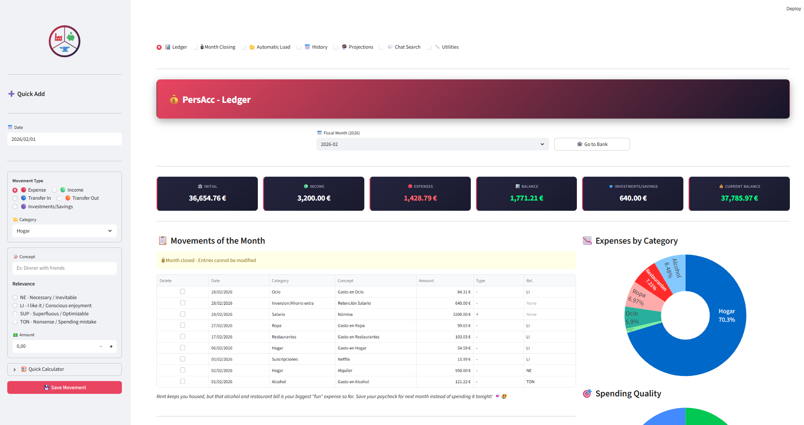
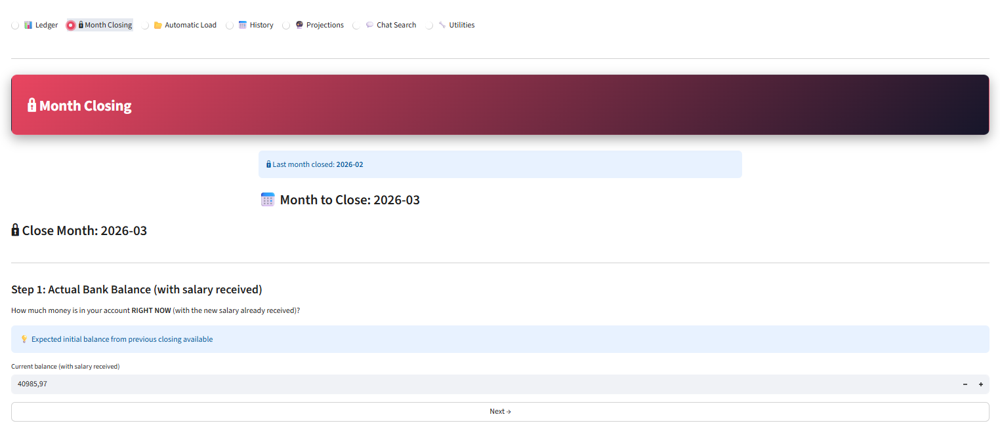
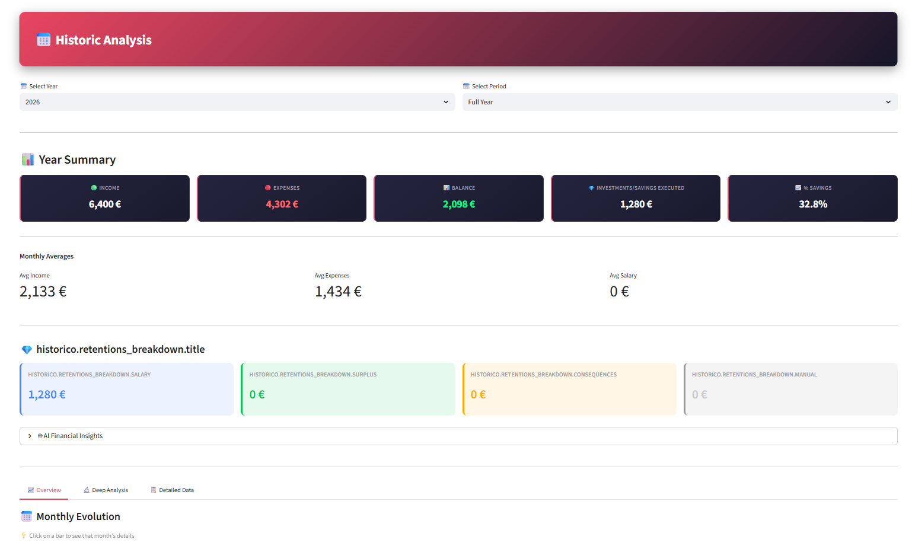
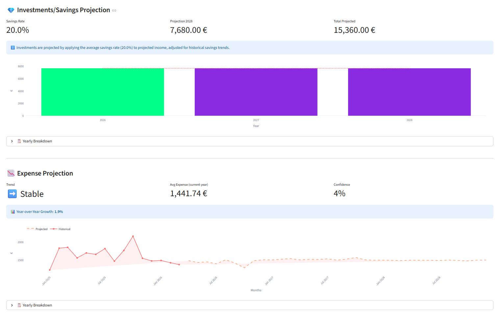
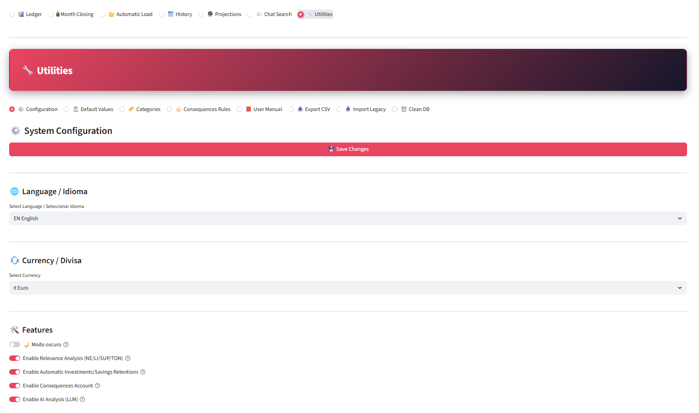

# PersAcc - Personal Accounting System

> Personal accounting system with monthly closing methodology, automatic savings retention, AI-powered financial analysis, and ML-based projections.

[](https://www.python.org/downloads/)
[](https://streamlit.io/)
[](https://www.sqlite.org/)
[](https://ollama.com/)
[](LICENSE)

## What is PersAcc?

**PersAcc** is a personal accounting application designed for people who want **full control over their monthly finances** through a rigorous accounting closing system (a deviation of my time with payroll systems), and flavoured with AI-powered insights and machine learning projections.

### Key Features

#### Core Accounting
- **Month Closing** - Step-by-step wizard that calculates retentions, generates immutable snapshots, and opens the next month
- **Configurable Retentions** - Set savings/investment % on surplus balance and salary
- **Expense Classification** - Relevance system (Necessary, Like, Superfluous, Nonsense) to analyze behavior
- **Consequences Account** - Automatic rules to track hidden costs and forced savings
- **Editable & Customizable** - Modify transactions, categories, and other settings
- **Smart Category Sorting** - Categories auto-sort by historical usage patterns
- **Default Values** - Auto-fill concepts, amounts, and relevance per category
- **CSV Import/Export** - Migrate from other apps or create backups

#### AI-Powered Features (Ollama)
- **Ledger AI Commentary** - Witty AI-generated comments on your monthly spending
- **Period Analysis** - Deep AI analysis of months or years with personalized recommendations
- **Smart Search** - Natural language queries with automatic parameter extraction

#### Analytics & Projections
- **Historical Dashboard** - Annual KPIs, monthly evolution, and trend analysis
- **ML Projections** - Predict salaries, expenses, and investments/savings for 5+ years
- **Spending Quality Analysis** - Visual NE/LI/SUP/TON breakdown

#### User Experience
- **Multi-language** - Spanish and English
- **Dark Mode** - Toggle dark theme from configuration
- **Built-in Manual** - Complete user guide in both languages
- **Bank URL Quick Link** - One-click access to your online banking from the sidebar

#### Integrations
- **Notion Sync** - Import transactions from a Notion database with auto-sync on startup
- **Bank File Import** - AI-powered import of AEB Norma 43, SEPA, and Excel bank files
- **Smart Deduplication** - Automatic duplicate detection when importing bank files

## Quick Start

See [**SETUP.md**](SETUP.md) for detailed installation instructions including:
- Local installation (Python)
- Docker deployment
- Ollama AI setup

### Minimal Setup (5 minutes)

```bash
# Clone repository
git clone https://github.com/Alvaro-San-Cav/PersAcc.git
cd PersAcc

# Install dependencies
pip install -r requirements.txt

# Run
streamlit run app.py
```

The app will open at `http://localhost:8501`

## AI Features Setup

PersAcc uses **Ollama** for local AI processing (completely offline and free).

### Quick Ollama Setup

1. **Install Ollama**: Download from [ollama.com](https://ollama.com/download)
2. **Download a model**:
   ```bash
   ollama pull phi3  # Recommended for balance (2.3GB)
   # Or: ollama pull qwen3:8b  # Author's current used
   # Or: ollama pull tinyllama (0.6GB, fast)
   # Or: ollama pull mistral (4.1GB, quality)
   ```
3. **Enable in app**: Go to Utilities > Configuration > Enable AI Analysis
4. **Select model**: Choose from available models in AI Configuration section
5. **Start using**: Chat Assistant tab for queries, Ledger for AI comments

See [**OLLAMA_SETUP.md**](OLLAMA_SETUP.md) for detailed AI configuration.

## Screenshots

### Main Dashboard

The main dashboard provides a comprehensive view of your monthly finances. Features include:
- **Real-time KPIs** displaying current balance, income, expenses, and savings rate
- **Editable transactions table** with inline editing, category assignment, and relevance classification
- **Spending quality chart** showing the distribution of NE/LI/SUP/TON expenses
- **Quick entry form** in the sidebar for adding new transactions rapidly



---

### Month Closing Wizard

The guided month closing process ensures accurate financial tracking with a 4-step wizard:
1. **Real Balance** - Enter your actual bank balance for reconciliation
2. **New Salary** - Record your salary and any recurring income
3. **Retentions** - Configure automatic savings percentages for surplus and salary
4. **Confirmation** - Review all calculated values before executing the close

The system creates immutable snapshots of closed months, preventing accidental modifications while keeping a complete financial history.



---

### Annual Summary

The annual summary dashboard provides a bird's-eye view of your yearly financial performance:
- **Yearly KPIs** including total income, expenses, savings, and investments/savings rates
- **Monthly evolution chart** showing income vs expenses trends throughout the year
- **Category breakdown** displaying where your money went by expense category
- **Comparative analysis** with previous years to track long-term financial progress



---

### Data Import (Cargar Datos)

Upload bank files and let AI automatically classify and categorize your transactions. Features include:
- **Multiple formats supported** including AEB Norma 43, SEPA, and Excel
- **Smart deduplication** to prevent importing the same transaction twice
- **AI-powered classification** for missing categories and concepts
- **Manual review process** before saving to your ledger


---

### Historical Analysis

Deep dive into your past financial data with interactive charts and insights. Features include:
- **Comparative analysis** across different years and months
- **Category breakdown** to understand spending habits over time
- **AI Period Analysis** for personalized insights on your behavior


---

### ML Projections

Forecast your financial future using machine learning models trained on your data. Features include:
- **SARIMAX modeling** for accurate trend and seasonality predictions
- **Income, expense, and savings forecasts** for the upcoming months
- **80% confidence intervals** to understand prediction certainty



---

### AI Chat Assistant

Interact with your finances using natural language for instant answers. Features include:
- **Natural language queries** in both English and Spanish
- **Smart parameter extraction** to find exactly what you're looking for
- **Direct ledger access** for accurate and up-to-date responses


---

### Utilities & Configuration

Manage your application settings and database easily. Features include:
- **Comprehensive configuration** for UI, language, AI models, and retentions
- **Category management** to add, edit, or archive categories
- **Data export/import** for backups or migrations
- **Notion integration settings** for seamless synchronization



## Key Concepts

### AI Chat Assistant

Ask questions in natural language about your finances:

**Examples:**
- "¿Cuánto gasté en transporte el año pasado?"
- "What are my biggest expenses this month?"
- "Busca gastos de Uber"
- "Show my savings rate for 2024"

**How it works:**
1. Enter your question in natural language (Spanish or English)
2. AI analyzes and extracts search parameters
3. Review results 

### ML Projections

The **Projections** feature tries to forecast your financial future:

- **Income Projections** - Linear regression on historical salary data
- **Investments/Savings Forecasts** - Based on savings rate and automatic retentions
- **Expense Predictions** - Trend analysis with seasonality detection

Each projection includes confidence levels (80% intervals), trend indicators, and interactive charts.

The projection engine uses **SARIMAX** (Seasonal ARIMA with eXogenous factors), a statistical model that captures both trends and seasonality. Models are trained automatically and cached for fast predictions.

### Month Closing

The **monthly closing flow** is the heart of PersAcc:

1. **Navigate to Month Closing** - System detects next month to close
2. **Enter bank balance** - Exact value from your bank account
3. **Enter salary amount** - New salary received
4. **Configure retentions** - Set surplus and salary retention %
5. **Review consequences** - If enabled, see rule-based forced savings
6. **Execute closing** - Creates entries and opens next month

**Result**: Immutable closed month + next month ready with correct opening balance.

### Spending Relevance

Classify each expense as:
- **NE** (Necessary) - Essential for living
- **LI** (Like) - Brings happiness/well-being  
- **SUP** (Superfluous) - Occasionally justifiable
- **TON** (Nonsense) - Impulsive or regretted

**Goal**: Analyze spending patterns and improve financial habits. (You can deactivate this feature in the configuration)

### Annotations

Add personal notes to any month or year to remember context, decisions, or reflections. Notes are shown in read-only mode when reviewing closed periods.

## Tech Stack

| Component | Technology |
|-----------|------------|
| Frontend | Streamlit |
| Backend | Python 3.9+ |
| Database | SQLite |
| AI/LLM | Ollama (local) |
| ML | scikit-learn, NumPy |
| Charts | Plotly |
| Container | Docker |

## Configuration Options

All settings in **Utilities > Configuration**:

| Category | Options |
|----------|---------|
| **Language** | Spanish, English |
| **Currency** | EUR, USD, GBP, CHF, JPY, MXN |
| **Dark Mode** | Toggle dark theme |
| **Toggles** | Relevance Analysis, Automatic Retentions, Consequences, AI Analysis |
| **Retentions** | Default % for surplus and salary |
| **Defaults** | Concepts, amounts, and relevance per category |
| **Closing Method** | Before salary / After salary |
| **AI Models** | Separate model per task: analysis, chat, summary, import |
| **Notion** | Enable/disable, API token, database ID, auto-check on startup |
| **Bank URL** | Quick link to your online banking |
| **Deduplication** | Amount tolerance, date window, text threshold, min score |

## Docker Deployment

```bash
# Build image
docker build -t persacc:latest .

# Run container
docker run -p 8501:8501 -v $(pwd)/data:/app/data persacc:latest
```

Data persists in the `./data` volume. See [SETUP.md](SETUP.md) for more details.

## Internationalization

PersAcc supports multiple languages:
- Spanish (default)
- English

Change language in **Utilities > Configuration**.

## Installer Releases (No Binary In Git)

Installer binaries are intentionally not stored in the repository.

- Local build (Windows): run `installer\\build_installer.bat`
- CI build artifact: run the `Build And Release Installer` workflow manually
- Official release: create and push a tag like `v3.1.0`; the workflow builds and uploads:
   - `PersAcc_Installer.exe`
   - `PersAcc_Setup_<tag>.zip`
   - release docs/warning files

This keeps the git history clean while still distributing Windows installers through GitHub Releases.

## Contributing

1. Fork the project
2. Create a branch: `git checkout -b feature/amazing-feature`
3. Commit changes: `git commit -m 'Add amazing feature'`
4. Push: `git push origin feature/amazing-feature`
5. Open a Pull Request

## License

This project is licensed under the **Creative Commons Attribution-NonCommercial-ShareAlike 4.0 International (CC BY-NC-SA 4.0)** license.

**Summary**: Free to share and adapt for non-commercial purposes with attribution.


## Contact

**Author**: Alvaro Sánchez  
**GitHub**: [@Alvaro-San-Cav](https://github.com/Alvaro-San-Cav)

---

If PersAcc is useful to you, give the repo a star!

**Version**: 3.1  
**Last updated**: March 2026
